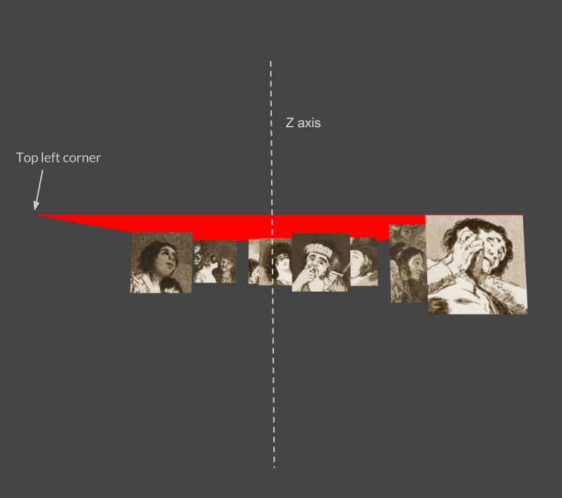

Our images are evenly dispersed, but we want them to start off the screen and fill up the stage. To do this, we will create a helper function in our `galleryData.js` file to create the positions that we will store in our module's state.

Since we rotated our main `#rotator-node`, the coordinates are also flipped by 90 degrees for our images. This means that modifying the Z coordinate moves our image nodes up and down, while the Y coordinate now controls the depth. 

You can think of it like we are looking at the red box ( `#rotator-node` ) from a bird eye's view. 

## Animating the nodes up

We want to start our images off the screen and slowly move them up.  To do this, we will start at a positive Z value off the screen (window height + random starting point) and then slowly decrement that Z value to move them up. 

Currently X and Y are randomly dispersed using: `Math.random()*500`. However, we can't use this same function for Z since we want to slowly increment the value without the `Math.random()` being called every time. Instead we will initialize random Z values in our state using a helper function. 

## Helper function to the rescue

Open up `galleryData.js` and add the following lines below our `imageData`:

	function randomCoordinates(imageData){
	    var contextSize = window.innerHeight
	 
	    var result = [];
	    for(var i=0; i < imageData.length; i++){
	    //start outside of the viewing window and random disperse below
	      result.push((contextSize+100)+Math.random()*contextSize*2)
	    }
	    return result;
	}

We will use this to create an array of random Z positions --outside of the frame-- for each image node. Update the states so they call on this function passing in our imageData. 

	states: {
	      rotationValue: 0,
	      srcs: imageData,
	      contextSize: window.innerHeight, //update this value as well
	      positionZ:randomCoordinates(imageData)
    }
    
We will also update our context size to `window.innerHeight` so it fills the stage. Next, let's modify our behavior's position function for our `.gallery-item` nodes. 

    '.gallery-item':{
        
      //... other behaviors not shown ... //               
 
        'position': function($index, positionZ){ 
            return positionZ[$index]
	    }
    }
	        

Great we have everything set up to animate. In the next section, we will add events to modify the state and animate our image nodes. 

[Up next: Creating animations &raquo;](./animations.html)

